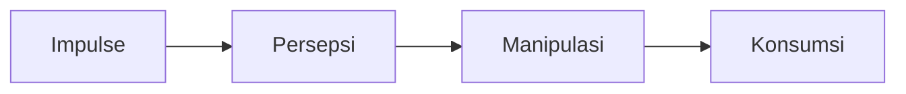

>[!SUMMARY]- Table of Contents
>- [Modul 6 - Antropologi Pendidikan](Pengantar%20Pendidikan%20(MKDK4001).md#Modul%206%20-%20Antropologi%20Pendidikan)
>    - [KB1 Manusia dan Kebudayaan](Pengantar%20Pendidikan%20(MKDK4001).md#KB1%20Manusia%20dan%20Kebudayaan)
>        - [Study Outline](Pengantar%20Pendidikan%20(MKDK4001).md#Study%20Outline)
>        - [Goal](Pengantar%20Pendidikan%20(MKDK4001).md#Goal)
>        - [Manusia dan Kebudayaan](Pengantar%20Pendidikan%20(MKDK4001).md#Manusia%20dan%20Kebudayaan)
>        - [Kebudayaan dan Kesenian](Pengantar%20Pendidikan%20(MKDK4001).md#Kebudayaan%20dan%20Kesenian)
>        - [Latihan](Pengantar%20Pendidikan%20(MKDK4001).md#Latihan)
>    - [KB2 Hakikat Kebudayaan](Pengantar%20Pendidikan%20(MKDK4001).md#KB2%20Hakikat%20Kebudayaan)
>        - [Karakteristik - Karakteristik Pokok Kebudayaan](Pengantar%20Pendidikan%20(MKDK4001).md#Karakteristik%20-%20Karakteristik%20Pokok%20Kebudayaan)
>- [Modul 7 - Eksistensi Perubahan Sosial Hubungannya dengan Pendidikan Formal, Nonformal, dan Informal](Pengantar%20Pendidikan%20(MKDK4001).md#Modul%207%20-%20Eksistensi%20Perubahan%20Sosial%20Hubungannya%20dengan%20Pendidikan%20Formal,%20Nonformal,%20dan%20Informal)
>    - [KB1 - Eksistensi Perubahan Sosial dan Pendidikan Formal, Nonformal, dan Informal](Pengantar%20Pendidikan%20(MKDK4001).md#KB1%20-%20Eksistensi%20Perubahan%20Sosial%20dan%20Pendidikan%20Formal,%20Nonformal,%20dan%20Informal)
>        - [Eksistensi Perubahan Sosial](Pengantar%20Pendidikan%20(MKDK4001).md#Eksistensi%20Perubahan%20Sosial)
>        - [Eksistensi Pendidikan](Pengantar%20Pendidikan%20(MKDK4001).md#Eksistensi%20Pendidikan)
>    - [KB2 Glo](Pengantar%20Pendidikan%20(MKDK4001).md#KB2%20Glo)

%%ENDTOC%%

Name : Pengantar Pendidikan (MKDK4001)
Di akses pada : 20231109 15:24
Type : #book`
Link : `link here`
1. 
# Modul 6 - Antropologi Pendidikan
## KB1 Manusia dan Kebudayaan
### Study Outline
Ada 6 permasalahan pokok dipelajari
1. Manusia dan Kebudayaan, 
2. Kebudayaan dan Kesenian
3. Konsep Kebudayaan, 
4. Perkembangan Budaya dari Masa ke Masa, 
5. Budaya Global, Nasional, dan Lokal, Kebudayaan dan Kepribadian, serta 
6. Kebudayaan dan Pendidikan

**Kajian Kebudayaan dan Kesenian**
Membahas bahwa salah satu bentuk **hasil budaya masyarakat** adalah **kesenian**, yaitu pikiran, karya, dan hasil karya manusia yang memenuhi hasratnya akan keindahan. **Seni** adalah salah satu **bagian penting dari kebudayaan**, **kesenian** adalah **ungkapan kreativitas dari kebudayaan itu sendiri**

**Kajian Manusia dan Kebudayaan**
membahas bahwa manusia selalu berinteraksi dengan manusia lain dan lingkungan alam memenuhi kebutuhan hidupnya. Manusia juga berpikir dan mengemukakan gagasan dan ide-ide serta tindakan yang berkaitan dengan pranata sosial, yang selanjutnya direspon oleh masyarakat demi kebutuhan kehidupan kolektif dan akhirnya menjadi budaya masyarakat. Konsep kebudayaan meliputi definisi, unsur-unsur, sebab-sebab munculnya kebudayaan, jenis, wujud, hubungan antara wujud-wujud kebudayaan, karakteristik, fungsi kebudayaan, proses pembudayaan

**Kajian Perkembangan Budaya dari Masa ke Masa**
Meliputi evolusionisme dan difusionisme

**Kajian Budaya Global, Nasional, dan Lokal**
meliputi karakteristik budaya global, karakteristik budaya nasional, dan karakteristik budaya lokal.

**Kajian Kebudayaan dan Kepribadian**
meliputi pengertian kepribadian dan kepribadian nasional, cara kebudayaan mempengaruhi kepribadian, dan hubungan antara kebudayaan dengan kepribadian. Adapun kajian kebudayaan dan pendidikan meliputi konsep pranata pendidikan, hubungan komplementer antara kebudayaan dan pendidikan, fungsi-fungsi pendidikan dalam rangka konservasi dan inovasi kebudayaan, dan cultural lag.

### Goal
Dapat menjelaskan
- [ ] Konsep Kebudayaan dan Pendidikan
- [ ] Hubungan komplementer antara kebudayaan dan pendidikan
- [ ] fungsi-fungsi pendidikan dalam rangka konservasi dan inovasi kebudayaan

### Manusia dan Kebudayaan
Pranata sosial merupakan keseluruhan tindakan komunitas yang tertuju pada individu berdasarkan keadaan tertentu menurut cara yang sama, berdasarkan keadaan itu pula terdapat respon yang sama di pihak komunitas

Antropologi adalah ilmu yang mempelajari manusia dan kebudayaan secara menyeluruh.

Teori interaksi simbolik mengaitkan kemampuan berpikir manusia, tindakan, sikap-isyarat (gesture), penggunaan simbol-simbol dalam terjadinya interaksi antara individu-individu di masyarakat (Goodman dan Ritzer, 2005)

Totalitas sosial mendahului pemikiran individual baik secara logika maupun secara temporer. Mustahil seseorang dapat berpikir secara logika tanpa adanya kelompok sosial.

Stimulus sebagai sebuah kesempatan atau peluang untuk bertindak, bukan sebagai paksaan atau perintah.

---
📑Note
jadi seseorang itu mau bertindak ketika adanya kegiatan yang dilakukan kelompok sosial. instead, orang berfikir sendiri. Sebagai salah satu contoh K.H. Uzairon ngendika "Orang itu harus selalu diingatkan, tidak bisa orang itu mikir sendiri. Seperti kata orang2 'Dah biar mikir sendiri' itu salah besar". 

kemudian ketika seseorang itu diberikan stimulus itu bukan serta merta orang itu diberi perintah atau dipaksa. tetapi orang itu diberi kesempatan untuk bertindak sebelum mendapati konsekuensi dari kelompok masyarakat atau dari dirinya sendiri

---

Basis dan tahapan tindakan saling berhubungan yang mencerminkan satu kesatuan oraganik saling berhubungan secara dialektis adalah

**Impuls** merupakan tahap pertama tindakan yang meliputi stimulus atau rangsangan spontan berhubungan dengan alat indera dan reaksi aktor terhadap rangsangan, kebutuhan untuk melakukan sesuatu terhadap rangsangan itu.

**Persepsi** merupakan tahap kedua yaitu keadaan aktor menyelidiki dan bereaksi terhadap rangsangan yang berhubungan dengan impuls.

Setelah diri dan objek dipahami, selanjutnya **memanipulasi** objek atau mengambil tindakan berkenaan dengan objek itu

**Tahap Konsumsi** merupakan pelaksanaan atau pengambil tindakan yang memuaskan dorongan hati yang sebenarnya.

#### Isyarat
ada dua :
1. signifikan
2. non sifgnifikan

#### Pikiran
Pikiran merupakan proses percakapan seseorang pada diri sendiri yang tidak ditemukan pada diri individu. Pikiran muncul dan berkembang dalam proses sosial dan merupakan bagian integral dari proses sosial. 

---
makanya pikiran itu back to proses sosial. tanpa adanya proses sosial, orang nggak mau mikir

---

Diri yang dimaksud adalah kemampuan untuk menerima diri sendiri sebagai sebuah objek, kemampuan khusus untuk menjadi subjek maupun objek, mensyaratkan proses sosial komunikasi antar manusia

#### Kebudayaan 
Kebudayaan berkembang dengan amat pesat
padahal manusia sehari2 hanya bercakap, merenung, memaknai.

Kebudayaan tidak dapat diibaratkan sama sebagai peradaban, karena peradaban bergerak maju dengan satu logika sejarah, sementara kebudayaan memiliki logika kemajuannya masing masing tergantung aktivitas manusia

### Kebudayaan dan Kesenian
Menurut Koentjaraningrat Budaya berasal dari kata Sansekerta
Budhayah --> budhi (jamak) --> "budi" atau "akal"
**berarti "hal-hal yang bersangkutan dengan akal"**

Dalam bahasa inggris, berasal dari kata latin
Culture -->  Colere --> "Mengolah" atau "Mengerjakan"
berarti "mengolah tanah atau bertani"

Kebudayaan sering diartikan sebagai the general body of the arts, yang meliputi seni sastra, seni musik, seni pahat, seni rupa, pengetahuan filsafat atau bagian-bagian yang indah dari kehidupan manusia.

**Umar Kayam,** menyatakan bahwa seni adalah sebagai salah satu bagian yang terpenting dari kebudayaan, kesenian adalah ungkapan kreativitas dari kebudayaan itu sendiri

Menurut Sedyawati, sifat kegiatan seni itu pada masyarakat/manusia merupakan kegiatan khas, yang dapat dibedakan dari kegiatan-kegiatan manusia lain. Letak kekhasannya adalah dalam kenyataan bahwa seni itu, baik dalam aspeknya sebagai kegiatan seni maupun sebagai hasil karya seni, memberi jenis kepuasan tertentu bagi manusia, yaitu kepuasan yang bersifat emosional dan sekaligus indrawi, dan sering kali juga disertai kepuasan pemahaman konseptual.

#### Definisi Kebudayaan
> [!quote]
> Koentjaraningrat mengutip pendapat dua ahli antropologi, dalam buku "ternyata ada 176 buah definisi mengenai kebudayaan yang pernah diterbitkan"

Sir Edward Burnett Tylor "kebudayaan adalah 'mencakup keseluruhan yang meliputi pengetahuan, kepercayaan, hukum, moral, kebiasaan, dan lain-lain kecakapan dan kebiasaan yang diperoleh manusia sebagai anggota masyarakat'." (Haviland, 1985)

Kebudayaan terdiri atas berbagai pola, bertingkah laku mantap, pikiran, perasaan, dan reaksi yang diperoleh dan terutama diturunkan oleh simbol-simbol yang menyusun pencapaiannya secara tersendiri dari kelompok-kelompok manusia, termasuk di dalamnya perwujudan benda-benda materi; pusat esensi kebudayaan terdiri atas tradisi, cita-cita atau paham, dan terutama keterikatan terhadap nilai-nilai.

**Koentjaraningrat**: kebudayaan adalah seluruh total dari pikiran, karya, dan hasil karya manusia yang tidak berakar kepada nalurinya karena itu hanya bisa dicetuskan oleh manusia sesudah suatu proses belajar

Orang memelihara kebudayaan untuk menangani masalah dan persoalan yang mereka hadapi. Agar lestari, kebudayaan harus dapat memenuhi kebutuhan-kebutuhan pokok dari orang-orang yang hidup menurut peraturan-peraturannya, dan mengatur agar anggota masyarakat dapat hidup secara teratur. Dalam hal ini, kebudayaan harus menemukan keseimbangan antara kepentingan pribadi masing-masing orang dan kebutuhan masyarakat sebagai suatu keseluruhan. Kebudayaan harus memiliki kemampuan untuk berubah agar dapat menyesuaikan diri dengan keadaan-keadaan baru atau mengubah persepsinya tentang keadaan yang ada sehingga kebudayaan dapat memenuhi kebutuhan hidup masyarakatnya, sesuai dengan tujuan masyarakat menciptakan kebudayaan agar mendapatkan kesejahteraan hidupnya

#### Unsur-unsur Universal Kebudayaan
Unsur universal seluruh dunia menurut C. Kluckhohn:
1. bahasa;
2. sistem pengetahuan;
3. organisasi sosial;
4. sistem peralatan hidup dan teknologi;
5. sistem mata pencaharian untuk hidup;
6. sistem religi;
7. kesenian

Unsur Universal kebudayaan indonesia:
1. Sistem religi dan upacara keagamaan
2. Sistem dan organisasi  kemasyarakatan
3. Sistem pengetahuan
4. Bahasa
5. Kesenian
6. Sistem mata pencaharian hidup
7. Sistem teknologi dan peralatan
Sistematika tata urutan menggambarkan kontinum dari yang paling sukar berubah ke yang paling mudah berubah

**Peter L. Berger (dalam Evers, 1998)** mengatakan bahwa menjadi manusia berarti hidup dalam dunia, yang sekaligus berarti hidup dalam realitas yang teratur dan memberi makna bagi kehidupan

##### Sebab Munculnya Kebudayaan
1. anggapan bahwa adanya hukum pemikiran atau perbuatan manusia yang muncul karena adanya tindakan besar menuju kepada perbuatan yang sama dan penyebabnya sama
2. anggapan bahwa tingkat kebudayaan atau peradaban muncul sebagai akibat taraf perkembangan dan hasil evaluasi masing-masing proses sejarahnya

#### Jenis jenis Kebudayaan
Hasil kebudayaan secara garis besar dibagi dua jenis:
1. Kebudayaan Material (Material Culture/Kebendaan)
2. Kebudayaan Non Material (Rohaniah) seperti :
	- Hasil Cipta Manusia (Filsafat serta Ilmu Pengetahuan, baik yang berwujud teori maupun applied sciences)
	- Hasil Rasa Manusia (berwujud nilai-nilai dan macam-macam norma 'agama, religi, ideologi, dll')
##### Wujud Kebudayaan
Pakar sosiologi **Talcott Parsons** maupun pakar antropologi **A.L Kroeber** pernah menganjurkan untuk membedakan antara wujud kebudayaan sebagai suatu sistem dari gagasan-gagasan serta konsep-konsep dan wujud kebudayaan sebagai rangkaian tindakan serta aktivitas manusia yang berpola

J. Honingman membuat perbedaan di antara tiga gejala kebudayaan, yakni (1) ideas, (2) activities, dan (3) artifacts
1. Ideas (Komplek gagasan konsep dan pikiran manusia); Wujud ini disebut sistem budaya, sifatnya abstrak, tidak dapat dilihat, dan berpusat pada pikiran-pikiran manusia yang menganutnya
2. Activities, berupa aktivitas manusia yang saling berinteraksi, bersifat konkret, dapat diamati atau diobservasi. Wujud ini sering disebut sistem sosial.
3. Artifact, (Wujud sebagai benda); aktivitas manusia yang saling berinteraksi tidak terlepas dari penggunaan peralatan sebagai hasil karya manusia untuk mencapai tujuannya.

Koentjaraningrat (2005) berpendapat bahwa kebudayaan dibeda-bedakan sesuai dengan wujudnya, yaitu:
1. Kebudayaan Fisik
2. Kebudayaan Sistem Sosial
3. Kebudayaan sebagai sistem budaya
4. Kebudayaan sebagai sistem ideal

#### Hubungan antara Wujud-wujud Kebudayaan
Kebudayaan sistem ideal memberi arah kepada perbuatan, cipta, karsa, dan karya manusia. Berbagi ide, gagasan, yang berpusat pada pikiran-pikiran manusia penganut kebudayaan maupun aktivitas manusia menghasilkan benda-benda kebudayaan fisik yang bersifat konkret, bisa diraba, dan difoto. Sebaliknya, kebudayaan yang bersifat fisik (artifacts) itu membentuk suatu lingkungan hidup tertentu yang adakalanya makin lama makin menjauhkan manusia dari lingkungan alamiahnya sehingga mempengaruhi pula aktivitas-aktivitasnya, pola-pola perbuatannya, bahkan juga mempengaruhi cara-cara berpikirnya

### Latihan

---
## KB2 Hakikat Kebudayaan
### Karakteristik - Karakteristik Pokok Kebudayaan
1. Kebudayaan adalah milik Bersama
2. Kebudayaan adalah hasil belajar
3. Kebudayaan didasarkan pada Lambang

# Modul 7 - Eksistensi Perubahan Sosial Hubungannya dengan Pendidikan Formal, Nonformal, dan Informal

**General Competence**
1. Menjelaskan secara singkat eksistensi perubahan-perubahan sosial
2. Menjelaskan secara singkat eksistensi pendidikan dan eksistensi perubahan sosial
3. Menjelaskan Globalisasi, Ilmu Pengetahuan dan Teknologi, serta Demokratisasi dalam Perubahan Sosial

**Specific Competence**
MAIN TOPIC : Perubahan Sosial
SUB TOPIC:
1. Eksistensi Perubahan Sosial dan Pendidikan Formal, Nonformal, dan Informal
2. Globalisasi, Ilmu Pengetahuan dan Teknologi serta Demokratisasi dalam Perubahan Sosial.

## KB1 - Eksistensi Perubahan Sosial dan Pendidikan Formal, Nonformal, dan Informal

### Eksistensi Perubahan Sosial
#### Pengertian Perubahan Sosial

- **William F. Ogburn** mengemukakan bahwa lingkup perubahan sosial meliputi unsur-unsur kebudayaan baik yang bersifat material maupun immaterial.
- **Mac Iver** menyebutkan bahwa perubahan-perubahan sosial adalah ekspresi dari jiwa yang terwujud dalam cara-cara hidup dan berpikir, pergaulan hidup, seni kesusastraan, agama, rekreasi, dan hiburan.
- **Gilin dan Gilin** mengatakan bahwa perubahan-perubahan sosial adalah suatu variasi dari cara-cara hidup yang telah diterima, yang disebabkan baik perubahan-perubahan kondisi geografis, kebudayaan materiil, komposisi penduduk, ideologi maupun karena adanya difusi ataupun penemuan-penemuan baru dalam masyarakat.
- **Selo Soemardjan** menyebutkan bahwa perubahan-perubahan sosial adalah segala perubahan pada lembaga-lembaga kemasyarakatan di dalam suatu masyarakat yang mempengaruhi sistem sosialnya, termasuk di dalamnya nilai-nilai, sikap-sikap, dan pola-pola perilaku di antara kelompok-kelompok dalam masyarakat.
- **Kingsley Davis** menyebutkan bahwa perubahan-perubahan sosial adalah perubahan-perubahan yang terjadi di dalam struktur dan fungsi masyarakat. Misalnya, timbulnya pengorganisasian buruh dalam masyarakat kapitalis telah menyebabkan perubahan-perubahan dalam hubungan antara buruh dan majikan dan seterusnya yang menyebabkan perubahan-perubahan organisasi ekonomi dan politik.
- **Samuel Koening** mengatakan bahwa perubahan sosial menunjukkan pada modifikasi-modifikasi yang terjadi dalam pola-pola kehidupan manusia. Modifikasi ini terjadi karena intern maupun ekstern

Perubahan sosial adalah perubahan lembaga-lembaga kemasyarakatan di dalam lingkup hidup masyarakat yang pada akhirnya mempengaruhi sistem sosialnya, termasuk di dalamnya nilai-nilai, sikap-sikap, dan pola perilaku di antara kelompok-kelompok di dalam masyarakat

>[!wikipedia]-
>**Perubahan Sosial** adalah bentuk peralihan yang mengubah tata kehidupan masyarakat yang berlangsung terus menerus karena sifat sosial yang dinamis dan bisa terus berubah, dan merupakan perubahan-perubahan yang terjadi pada individu dalam masyarakat dan juga lembaga-lembaga kemasyarakatan dalam suatu masyarakat yang memengaruhi sistem sosialnya, termasuk nilai, adat, budaya, sikap-sikap sosial dari Individu masyaraka tersebut, dan pola perilaku di antara kelompok-kelompok dalam masyarakat.
>
> [Wikipedia](https://id.wikipedia.org/wiki/Perubahan%20sosial)

Perubahan sosial merupakan sesuatu yang normal terjadi dan terus berkelanjutan sesuai dengan arah, tingkat, dan kecepatan perubahan kehidupan masyarakat. Untuk memahami perubahan, kita harus melakukan analisis karena pemahaman mengenai perubahan adalah prasyarat untuk memahami struktur masyarakat. Orang yang memandang masyarakat sebagai sistem yang berada dalam keseimbangan dan yang mencoba menganalisis aspek struktural sistem masyarakat, akan mengakui bahwa keseimbangan (equiliberium) hanya dapat dipertahankan melalui perubahan tertentu di dalam sistem tersebut

#### Bentuk-bentuk Perubahan Sosial
Perubahan sosial meliputi jenis-jenis sebagai berikut:
1. Perubahan yang terjadi secara lambat dan perubahan yang terjadi secara cepat
2. Perubahan yang pengaruhnya kecil dan perubahan yang besar pengaruhnya
3. Perubahan yang dikehendaki atau direncanakan dan perubahan yang tidak dikehendaki atau tidak direncanakan

#### Sebab Terjadinya Perubahan Sosial
1. Penyebab yang datangnya dari dalam masyarakat
	Faktor internalnya :
	- Perubahan penduduk
	- Penemuan-penemuan baru
	- Pertentangan atau konflik masyarakat
	- Terjadinya Revolusi intern di dalam masyarakat
2. Penyebab yang berasal dari luar masyarakat
	- Sebab-sebab yang berasal dari lingkungan alam fisik yang ada di sekitar manusia.
	- Peperangan
	- Pengaruh kebudayaan masyarakat lain.

### Eksistensi Pendidikan
Pendidikan dalam konteks Indonesia dipahami sebagai "Usaha sadar dan terencana untuk mewujudkan suasana belajar dan proses pembelajaran agar peserta didik secara aktif mengembangkan potensi dirinya untuk memiliki kekuatan spiritual keagamaan, pengendalian diri, kepribadian, kecerdasan, akhlak mulia, serta keterampilan yang diperlukan dirinya, masyarakat, bangsa, dan negara” (Pasal 1, ayat 1)

Pendidikan merupakan sesuatu yang mutlak bagi umat manusia.

Sejak masa perkembangan peradaban kuno sampai munculnya abad pencerahan (renaisance) di Eropa, pendidikan mendapat tempat utama dan strategis dalam kehidupan pemerintahan. Pendidikan adalah hal paling utama, hal itu setidaknya dapat kita lihat dari pendapat beberapa ahli berikut ini; 

**Jean Jaqques Rosseau**, seorang tokoh pembaharu Prancis menyebutkan, *semua yang kita butuhkan dan semua kekurangan kita waktu lahir hanya akan kita penuhi melalui pendidikan*.

**Aristoteles**, ahli filsafat Yunani kuno berpendapat bahwa *perbaikan masyarakat hanya dapat dilakukan dengan terlebih dahulu memperbaiki sistem pendidikan*.

**Van de Venter**, tokoh politik etis atau balas budi yang menjadi tonggak awal perkembangan munculnya golongan terpelajar Indonesia juga mengatakan, *pendidikan yang diberikan kepada rakyat pribumi, akan dapat mengubah nasib kaum pribumi*. 

Tokoh Pendiri Pendidikan Nasional, yakni **Ir. Soekarno** dan **Ki Hajar Dewantara,** juga menyebutkan bahwa satu-satunya yang dapat mengubah nasib suatu bangsa hanyalah **pendidikan**.

Eksistensi pendidikan realitasnya ada di tengah kehidupan masyarakat, oleh karena itu antara pendidikan dan masyarakat memiliki hubungan ketergantungan yang sangat erat. Pendidikan mengabdikan seluruh eksistensinya kepada masyarakat yang dengan segala norma-norma dan nilai-nilai budayanya menjadi semakin berkembang dan maju berkat kemajuan di bidang pendidikan. 

Pendidikan adalah sebuah upaya dan proses pematangan serta pendewasaan kehidupan masyarakat. Oleh karena itu, eksistensi lembaga-lembaga pendidikan harus selalu menyadari tugasnya yang sangat mendasar, yakni memformat Sumber Daya Manusia (SDM) yang unggul di tengah kehidupan masyarakat

**Perubahan pada masyarakat dapat selalu terjadi sebagai sesuatu yang bersifat alamiah atau sebagai sesuatu yang direncanakan.**

Perubahan pada masyarakat ini merupakan suatu proses yang luas, dan lengkap yang mencakup perubahan pada seluruh tatanan kehidupan masyarakat. Perubahan pada masyarakat bukan hanya merupakan serpihan dari peristiwa sekelompok manusia tetapi fenomena itu menjadi saksi adanya suatu proses perubahan empiris dari kehidupan umat manusia. 

Oleh karena itu daya serap perubahan sosial akan selalu merembes ke segala segi kehidupan masyarakat, khususnya di bidang pendidikan. Melalui pewarisan kebudayaan dan internalisasi nilai pada setiap individu, pendidikan hadir dalam bentuk sosialisasi kebudayaan, yang berinteraksi dengan nilai-nilai masyarakat dan memelihara interaksi masyarakat-masyarakat tersebut, yang pada akhirnya juga berpengaruh pada perubahan tatanan sosio-kultural masyarakat secara keseluruhan

## KB2 Glo

# Modul 8 - Hakikat Sistem Pendidikan Nasional
