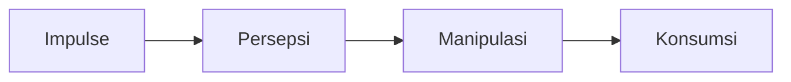

>[!SUMMARY]+ Table of Contents
>- [Manusia dan Kebudayaan](Modul%206%20Antropologi%20Pendidikan.md#Manusia%20dan%20Kebudayaan)
>    - [Study Outline](Modul%206%20Antropologi%20Pendidikan.md#Study%20Outline)
>        - [Kajian Kebudayaan dan Kesenian](Modul%206%20Antropologi%20Pendidikan.md#Kajian%20Kebudayaan%20dan%20Kesenian)
>        - [Kajian Manusia dan Kebudayaan](Modul%206%20Antropologi%20Pendidikan.md#Kajian%20Manusia%20dan%20Kebudayaan)
>        - [Kajian Perkembangan Budaya dari Masa ke Masa](Modul%206%20Antropologi%20Pendidikan.md#Kajian%20Perkembangan%20Budaya%20dari%20Masa%20ke%20Masa)
>        - [Kajian Budaya Global, Nasional, dan Lokal](Modul%206%20Antropologi%20Pendidikan.md#Kajian%20Budaya%20Global,%20Nasional,%20dan%20Lokal)
>        - [Kajian Kebudayaan dan Kepribadian](Modul%206%20Antropologi%20Pendidikan.md#Kajian%20Kebudayaan%20dan%20Kepribadian)
>    - [Goal](Modul%206%20Antropologi%20Pendidikan.md#Goal)
>- [Manusia dan Kebudayaan](Modul%206%20Antropologi%20Pendidikan.md#Manusia%20dan%20Kebudayaan)
>    - [Isyarat](Modul%206%20Antropologi%20Pendidikan.md#Isyarat)
>    - [Pikiran](Modul%206%20Antropologi%20Pendidikan.md#Pikiran)
>    - [Kebudayaan](Modul%206%20Antropologi%20Pendidikan.md#Kebudayaan)
>- [Kebudayaan dan Kesenian](Modul%206%20Antropologi%20Pendidikan.md#Kebudayaan%20dan%20Kesenian)
>    - [Definisi Kebudayaan](Modul%206%20Antropologi%20Pendidikan.md#Definisi%20Kebudayaan)
>    - [Unsur-unsur Universal Kebudayaan](Modul%206%20Antropologi%20Pendidikan.md#Unsur-unsur%20Universal%20Kebudayaan)
>- [Hakikat Kebudayaan](Modul%206%20Antropologi%20Pendidikan.md#Hakikat%20Kebudayaan)

%%ENDTOC%%

[[Sesi 5 Antropologi Pendidikan]]
#Pengantar_Pendidikan 
#  KB1 Manusia dan Kebudayaan
## Study Outline
Ada 6 permasalahan pokok dipelajari
1. Manusia dan Kebudayaan, 
2. Kebudayaan dan Kesenian
3. Konsep Kebudayaan, 
4. Perkembangan Budaya dari Masa ke Masa, 
5. Budaya Global, Nasional, dan Lokal, Kebudayaan dan Kepribadian, serta 
6. Kebudayaan dan Pendidikan

### Kajian Kebudayaan dan Kesenian
Membahas bahwa salah satu bentuk **hasil budaya masyarakat** adalah **kesenian**, yaitu pikiran, karya, dan hasil karya manusia yang memenuhi hasratnya akan keindahan. **Seni** adalah salah satu **bagian penting dari kebudayaan**, **kesenian** adalah **ungkapan kreativitas dari kebudayaan itu sendiri**

### Kajian Manusia dan Kebudayaan
membahas bahwa manusia selalu berinteraksi dengan manusia lain dan lingkungan alam memenuhi kebutuhan hidupnya. Manusia juga berpikir dan mengemukakan gagasan dan ide-ide serta tindakan yang berkaitan dengan pranata sosial, yang selanjutnya direspon oleh masyarakat demi kebutuhan kehidupan kolektif dan akhirnya menjadi budaya masyarakat. Konsep kebudayaan meliputi definisi, unsur-unsur, sebab-sebab munculnya kebudayaan, jenis, wujud, hubungan antara wujud-wujud kebudayaan, karakteristik, fungsi kebudayaan, proses pembudayaan

### Kajian Perkembangan Budaya dari Masa ke Masa
Meliputi evolusionisme dan difusionisme

### Kajian Budaya Global, Nasional, dan Lokal
meliputi karakteristik budaya global, karakteristik budaya nasional, dan karakteristik budaya lokal.

### Kajian Kebudayaan dan Kepribadian
meliputi pengertian kepribadian dan kepribadian nasional, cara kebudayaan mempengaruhi kepribadian, dan hubungan antara kebudayaan dengan kepribadian. Adapun kajian kebudayaan dan pendidikan meliputi konsep pranata pendidikan, hubungan komplementer antara kebudayaan dan pendidikan, fungsi-fungsi pendidikan dalam rangka konservasi dan inovasi kebudayaan, dan cultural lag.

## Goal
Dapat menjelaskan
- [ ] Konsep Kebudayaan dan Pendidikan
- [ ] Hubungan komplementer antara kebudayaan dan pendidikan
- [ ] fungsi-fungsi pendidikan dalam rangka konservasi dan inovasi kebudayaan

## Manusia dan Kebudayaan
Pranata sosial merupakan keseluruhan tindakan komunitas yang tertuju pada individu berdasarkan keadaan tertentu menurut cara yang sama, berdasarkan keadaan itu pula terdapat respon yang sama di pihak komunitas

Antropologi adalah ilmu yang mempelajari manusia dan kebudayaan secara menyeluruh,

Teori interaksi simbolik mengaitkan kemampuan berpikir manusia, tindakan, sikap-isyarat (gesture), penggunaan simbol-simbol dalam terjadinya interaksi antara individu-individu di masyarakat (Goodman dan Ritzer, 2005)

Totalitas sosial mendahului pemikiran individual baik secara logika maupun secara temporer. Mustahil seseorang dapat berpikir secara logika tanpa adanya kelompok sosial.

Stimulus sebagai sebuah kesempatan atau peluang untuk bertindak, bukan sebagai paksaan atau perintah.

---
📑Note
jadi seseorang itu mau bertindak ketika adanya kegiatan yang dilakukan kelompok sosial. instead, orang berfikir sendiri. Sebagai salah satu contoh K.H. Uzairon ngendika "Orang itu harus selalu diingatkan, tidak bisa orang itu mikir sendiri. Seperti kata orang2 'Dah biar mikir sendiri' itu salah besar". 

kemudian ketika seseorang itu diberikan stimulus itu bukan serta merta orang itu diberi perintah atau dipaksa. tetapi orang itu diberi kesempatan untuk bertindak sebelum mendapati konsekuensi dari kelompok masyarakat atau dari dirinya sendiri

---

Basis dan tahapan tindakan saling berhubungan yang mencerminkan satu kesatuan oraganik saling berhubungan secara dialektis adalah

**Impuls** merupakan tahap pertama tindakan yang meliputi stimulus atau rangsangan spontan berhubungan dengan alat indera dan reaksi aktor terhadap rangsangan, kebutuhan untuk melakukan sesuatu terhadap rangsangan itu.

**Persepsi** merupakan tahap kedua yaitu keadaan aktor menyelidiki dan bereaksi terhadap rangsangan yang berhubungan dengan impuls.

Setelah diri dan objek dipahami, selanjutnya **memanipulasi** objek atau mengambil tindakan berkenaan dengan objek itu

**Tahap Konsumsi** merupakan pelaksanaan atau pengambil tindakan yang memuaskan dorongan hati yang sebenarnya.

### Isyarat
ada dua :
1. signifikan
2. non sifgnifikan

### Pikiran
Pikiran merupakan proses percakapan seseorang pada diri sendiri yang tidak ditemukan pada diri individu. Pikiran muncul dan berkembang dalam proses sosial dan merupakan bagian integral dari proses sosial. 

---
makanya pikiran itu back to proses sosial. tanpa adanya proses sosial, orang nggak mau mikir

---

Diri yang dimaksud adalah kemampuan untuk menerima diri sendiri sebagai sebuah objek, kemampuan khusus untuk menjadi subjek maupun objek, mensyaratkan proses sosial komunikasi antar manusia

### Kebudayaan 
Kebudayaan berkembang dengan amat pesat
padahal manusia sehari2 hanya bercakap, merenung, memaknai.

Kebudayaan tidak dapat diibaratkan sama sebagai peradaban, karena peradaban bergerak maju dengan satu logika sejarah, sementara kebudayaan memiliki logika kemajuannya masing masing tergantung aktivitas manusia

## Kebudayaan dan Kesenian
Budaya berasal dari kata Sansekerta
Budhayah --> budhi (jamak) --> "budi" atau "akal"
**berarti "hal-hal yang bersangkutan dengan akal"**

Dalam bahasa inggris, berasal dari kata latin
Culture -->  Colere --> "Mengolah" atau "Mengerjakan"
berarti "mengolah tanah atau bertani"

Kebudayaan sering diartikan sebagai the general body of the arts, yang meliputi seni sastra, seni musik, seni pahat, seni rupa, pengetahuan filsafat atau bagian-bagian yang indah dari kehidupan manusia.

**Umar Kayam,** menyatakan bahwa seni adalah sebagai salah satu bagian yang terpenting dari kebudayaan, kesenian adalah ungkapan kreativitas dari kebudayaan itu sendiri

Menurut Sedyawati, sifat kegiatan seni itu pada masyarakat/manusia merupakan kegiatan khas, yang dapat dibedakan dari kegiatan-kegiatan manusia lain. Letak kekhasannya adalah dalam kenyataan bahwa seni itu, baik dalam aspeknya sebagai kegiatan seni maupun sebagai hasil karya seni, memberi jenis kepuasan tertentu bagi manusia, yaitu kepuasan yang bersifat emosional dan sekaligus indrawi, dan sering kali juga disertai kepuasan pemahaman konseptual.

### Definisi Kebudayaan
> [!quote]
> Koentjaraningrat mengutip pendapat dua ahli antropologi, dalam buku "ternyata ada 176 buah definisi mengenai kebudayaan yang pernah diterbitkan"

Sir Edward Burnett Tylor "kebudayaan adalah 'mencakup keseluruhan yang meliputi pengetahuan, kepercayaan, hukum, moral, kebiasaan, dan lain-lain kecakapan dan kebiasaan yang diperoleh manusia sebagai anggota masyarakat'." (Haviland, 1985

Kebudayaan terdiri atas berbagai pola, bertingkah laku mantap, pikiran, perasaan, dan reaksi yang diperoleh dan terutama diturunkan oleh simbol-simbol yang menyusun pencapaiannya secara tersendiri dari kelompok-kelompok manusia, termasuk di dalamnya perwujudan benda-benda materi; pusat esensi kebudayaan terdiri atas tradisi, cita-cita atau paham, dan terutama keterikatan terhadap nilai-nilai.

Orang memelihara kebudayaan untuk menangani masalah dan persoalan yang mereka hadapi. Agar lestari, kebudayaan harus dapat memenuhi kebutuhan-kebutuhan pokok dari orang-orang yang hidup menurut peraturan-peraturannya, dan mengatur agar anggota masyarakat dapat hidup secara teratur. Dalam hal ini, kebudayaan harus menemukan keseimbangan antara kepentingan pribadi masing-masing orang dan kebutuhan masyarakat sebagai suatu keseluruhan. Kebudayaan harus memiliki kemampuan untuk berubah agar dapat menyesuaikan diri dengan keadaan-keadaan baru atau mengubah persepsinya tentang keadaan yang ada sehingga kebudayaan dapat memenuhi kebutuhan hidup masyarakatnya, sesuai dengan tujuan masyarakat menciptakan kebudayaan agar mendapatkan kesejahteraan hidupnya

### Unsur-unsur Universal Kebudayaan
Unsur universal seluruh dunia menurut C. Kluckhohn:
1. bahasa;
2. sistem pengetahuan;
3. organisasi sosial;
4. sistem peralatan hidup dan teknologi;
5. sistem mata pencaharian untuk hidup;
6. sistem religi;
7. kesenian

Unsur Universal kebudayaan indonesia:
1. Sistem religi dan upacara keagamaan
2. Sistem dan organisasi  kemasyarakatan
3. Sistem pengetahuan
4. Bahasa
5. Kesenian
6. Sistem mata pencaharian hidup
7. Sistem teknologi dan peralatan
Sistematika tata urutan menggambarkan kontinum dari yang paling sukar berubah ke yang paling mudah berubah

# KB2 Hakikat Kebudayaan
